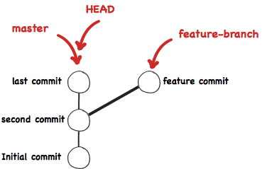

This is more a knowledge dump more than anything. I have added some tasks to complete at the end if you are for the challenge. Git is very complex and this file does not even scratch the surface. I encourage you to read this more than once as topics rely on later topics and vice versa. It will make more sense as you read it more than once. If I linked an externa page then its more of an advanced topic, so if its your first time using Git then skip it for now and come after you feel more confortable. 

Also pardon my spelling, I had no spelling cheking when I wrote this. If you want to fix somthing, hopefuly after reading this you will be able to submit a pull request to this repmote rpepository. More about contributing [here](https://github.com/NevadaCyberClub/knowkedge-base/blob/master/CONTRIBUTING.md#contributing-procedure).

# Git
## About Git
### What is Git? 
"Git is a free and open source distributed version control system designed to handle everything from small to very large projects with speed and efficiency." - [git-scm.com](https://git-scm.com/)   

A version control system helps manage different project versions. It is specially useful when working with muliple users in teh same project. Project here generally means code. 


#### Git vs Github
"The key difference between Git and GitHub is that Git is an open-source tool developers install locally to manage source code, while GitHub is an online service to which developers who use Git can connect and upload or download resources." - [source here](https://www.theserverside.com/video/Git-vs-GitHub-What-is-the-difference-between-them#:~:text=The%20key%20difference%20between%20Git,and%20upload%20or%20download%20resources.)


### Terminology
By reading this article you should get familiar with the following terminology, here is quick definitions to help you navigate yourself around, for more information read on.
| Term | Description|
|:--:|--|
|Commit| A snapshot of the project|
|Branch | A particular timeline, see pointer|
|Pointer | A label pointing to a commit hash on a branch
|Commit hash| A way to reliably identify each commit using SHA-1 algorithm


### How does Git work TODO
Its very clever.
When you create a change it takes the difference of the current file and the previous version of that file and created the commit. Commit after commit it  this chain/branch in the graph is a branch. Each commit is uniquel
Git generates a checksum for each change set
Git uses SHA-1 the hash algorithm to create checksums - 40 characters hexadecimal string
Simple way to come up with rather unique identifiers to commits
A series of commits is linked together since each commit points to its parent commit unless it is the initial commit along with other information like the author and message


## Initial setup

First setup your identity. Each time you commit to a repository it adds this information to it. Git will tell you to do this when you use it, so why not do it now. Its a one time setup. Online git repository website often use you email in a commit to link them to a particular account. 

Use the following command to setup your identity:   

```
$ git config --global user.name "Your Name"
$ git config --global user.email yourEmail@example.com
```

Next you will want to let know Git what is your prefered editor (else its going to use Vim which you may not know how to use):
```
$ git config --global core.editor nano 
```
Substitute `nano`  with your editor of choice.   


### What is tracking?
Git is amazing but you need to tell it what you want. Before Git can track your files for you you have to let it know that it needs to know that. To do that we add and commit the file once, after that Git will track it for you. You can verify that it is tracking certain file by using teh `git status` command, if it lists it as untracked then its not tracked. 

In this context we talk about file tracking and not branch tracking 

One thing to mentioned about tracked and untracked files. This will make more sense when you read the rest of this document. If a file is tracked Git can change its file contents when you change branches. Lets say you got back in history, now that particular tracked file will change to the previous version. As for untracked files, git will leave them alone. Git will not just let you lose your changes when you changes branches like that, ti will tell you hey I cant changes branches since I am going to change the file for you since you have incommited chagnes, please fix that and try again later. This is where a command like `git stash` comes into play, we wont get into deailts here but it essentially lets you temporarely stash away your work so you can do stuff, and when you are ready you can bring your uncommtied stuff back 


### What is staging?
Git is awesome and it allows you to pick and chose what you want to add into a commit. Before you can commit a change you have to tell Git what things you want to add into the commit. You do this by staging. Staging is the process of telling Git what is it that needs to be added in the next commit you want to make. 
Git 

allos you to work on you files however you like, once you are ready to make a commit. 
Git is amaxStaging


### What is a commit?
A commit is point in time where we wanted to snapshot the current state of the project. Git does this by saving the difference from the previous commit and saving it as a commit. Essentially Git saves as sequence of differences that can later be used to recontruct the state of things. These differences have a name you may have heard before, their name is a `patch`, and they can be manually created using the `git diff` command, but thats a more advanced topic.    




A commit is referenced by its hash (not in the above picture, see `git log`). This hash is created using the SHA-1 hashing algorithm on that particular commit/patch. Hashes have to froms:
- The long form 
   - Full sha-1 hash of the commit
   - looks like: `97dd2ae065771908ee9ae0fa08ccdb58b5a6b18f` 
- The short form 
   - The last 7 digits of the longs form by default
   - Looks like: `5a6b18f`

You will probably will not need to know this unless you are curious [here is how they create it the hash](https://gist.github.com/masak/2415865).

You are welcome to use either one inside of Git as having two commits with the same hash ending is pretty slim. But if for some reason they do use the long. In most places where you can use a commit hash you can also use a branch name (more on that later), but then again use common sense.

Each commit is identified with who made it. This is where your ientity comes in. There is this tool called `git blame` that leats you find who was responsable for a particular change (even by line number) on a particular file. Its awesome when you need to know who made the file if you need help or even find who added a bug hence blame. If you would like to read more about it read the [git blame documentation](https://git-scm.com/docs/git-blame).

Another thing that is becoming more important in cybersecurity in general is digital signing. You can have Git sign your commit using your provate GPG keys. Which allows other users to verify that you were in fact the one who commited it using your public key. If you want to read mroe on how to do this read [here](https://git-scm.com/book/en/v2/Git-Tools-Signing-Your-Work). GitHub/GitLab also have implemented this in their online editor, look for GPG keys on your private settings for the online repo. 


### Branches/pointers
Think of a branch as a story line, each branch is a series of commits. One can create a new branch by splitting of from a branch. In reality Git is very clever when it comes to how it work. Under the hood Git is just storing a graph of commits and it references them with pointers. It puts them together to form what we call branches. Pointer are just pointing to a specific commit, think of them as labels.

#### HEAD
`HEAD` points to where you are currently looking at, it can be another branch/label or a commit. I believe it can even be stashed code.

#### Master
`master` is just the default branch created but the software Git. you may be asking yourself, what about `main`?????? Well that is just Github's push to rename it. Worth noting, Git is not the same a Github. 

It is good practice to use the your default branch as the branch where you have working code. If you build a new feature, create a new branch first and work of that. If your new feature breaks your project, you always have something that runs. This tip is specially useful at work, where you may be expected to have something that always works. Once you are ready with the feature you can merge it back into your main branch. In bigger projects (like  Ubuntu for example), new features dont get merged into the `master` branch easily, they go from dev branches to release candidates to alpah, to beta and then to master (not very accurate names here but you get the point). 

### Creating a branch


#### Creating branch from another branch or commit hash

### Moving around
#### move back in time to a previous commit where there is no pointer


### staging the files 
### Commit mesages


### Commit history


### Unstage a file
So 👉👈 you accidentally stagged a file? well its easy.   
The command for unstaging a file depends on the circumstances the file was added. Worry not, I myself dont know what command to use, BUT git tells you. Just use the `git status` command and it tells you exactly how to do it.

### About unwanted changes, commits and pushing 
Commits are snapshots of your data, created by taking the difrerences from previous commits. They can get tricky to fix them as future things depends on previous commits. Read below TODO link, for more infor abou it.

### Git log 
TODO

Press `q` to exit.

### Viewing graph

If you would like to view a vidual representation of what your repository looks like then you can use the following 
#### Locally 
Use the following command:
```
git log --graph --oneline --decorate --all
```
Press `q` to exit. That is kind of hard to remember, lets make a shortcut/alias with the following commnad (do only once): 
```
git config --global alias.graph "log --graph --oneline --decorate --all"
```

now lets use our alias:
```
git graph
```

#### Remotelly 

## Remote repositories
In the initial part of this tutorial you worked locally. In this section you will be working with remote repositories. Essentially, it is copying/syncing your local repository with a remote server, This allows multiple people to work on the code at once. Merge conflicts are managed locally. The default name for your first remote server ina repository is `origin`. Your local repository can point to multiple remote locations, for example, one can push code to a backup code server, a production server, a developemnt server ...etc.

### Most common providers
You can register for an account on their respective websites.

- Github
- Gitlab
- Bitbucket

### Terminology
Pull 
fetch
Clone 
Merge
Commit
### Configuring credentials 
Credentials allow you to authenticate with the foreign server as the remote server will not allow anyone to edit the code (just the authorized individuals) and if the code is provate it may not allow anyone to pull from the code.
There are two methods, one is using HTTPS, the other is using SSH. HTTPS is just using your username and password for the remote repo. SSH is just like SSH key authentication, you share your public key with the remote server and the system takes cares of auth using your keys.

HTTPS is easier, but you have to login eveytime authentication is required. Which is what we are going to use for this tutorial. SSH has more initial setup, but after that you can forget about it.

More info on SSH setup [here](https://docs.github.com/en/authentication/connecting-to-github-with-ssh/about-ssh).

### Adding a remote location 
remote -v 
remote add origin 

note; haveing mutliple remotes is useful ehrn having mutliple server, for example whe you have CICD pipelines where code gets automatically depyed, you push to github and it archives it, yo upush to remote server dev repo and it puts it in production... etc also TODO fix spelling here lol 
### Note on some comands 
If we take a look at the following command we see that we are talking about the server `origin` and local branch `master`:   
```
git push origin master
````
This implies that the remote branch is also called `master`. In the event that the remote branch is named diffrent you can specify as follows:      
```
git push origin localBranchName:remoteBranchName
```

### Pulling 
### Fetching
### Pushing 


You can do multiple commits without sycing eveytime, just push whenever you think its appropate.
You can push to any branch you woud like, by default its the defaul set in your remote server, usually master. Sometimes in the remote server master is a protected branch, meaning you cant edit it directly, you have to push to another branch and merge it int eh remote server (usually via gui, or via termianal using the force flags). 

#### Branch tracking
Branch tracking is when you let your local git repo know that a particular local branch is certain remote branch from a particular remote server. This can allow you not to specify remote and branches when you are talking/working on a local branch, allows you to do things like `git push`, `git pull` withut having to specify `origin master:master` ...
The easient way yo set this tracking is on the first push for that particular branch. The first inital push you will set your local branch to track a remote branch with the `-u`/`--set-upstream`  flag. For example `git push -u origin master`. If you have already pushed you can use `git branch -u <remote> <branch>` comand to achieve the same without pushing)


### merging 

### Forking vs Cloning

### git log 
# When in dount use this
Here is a tip Ive picked up over years of using Git. If you have no idea what is going on us this command to gain a sence of what is happening. 
```
git status
```
Seems silly but git tells you what to do. You got yourself into a merge and have no idea what to do? `git status`. Accidentally staged a file? `git status` will tell you the right command to use. 

#### About messing up
copy paste the folder incliding the .git folder

The longer you wait to fix the problem, I.E. the more you propagate the problem:
- file mistake
- stage/add mistake 
- commit mistake
- push mistake to remote serrver
- commit more changes after mistake
- push commits after mistake on remote branch
the more complicated it gets to revert it. So as a rule of thumb, the sooner you spot a mistake on anyhing (realting to code or git related like commit mesages etc) the better. Consider this, if you are working on a team, and you push something that needs to be ammended, now at any pint anyone can either work on that code and push new stuff on top of that (remember that we use a remote server as a central hub of truth of the project). As git works by taking differences, the more stuff you pile on the history the harder it makes it to rewrite history. If you can fix things before things gets pushed remotelly the better. This does not mean that you cant fix things, it just makes it easier. So if you mess us just google "I did this on git... how do I undo it/fix it", bound to find an answer. 


# Advanced reading 
## Git bisect
Read more about bisect in the [git bisect docs](https://git-scm.com/docs/git-bisect). If you have a bug but you dont know what commit introduced it, this command is you friend, it lets you try out branches and asks you if you see the problem. It helps you find it. This command can not only be sued for finding bugs but helps you loacate branches using any binary questions, at teh end of the day its binary search.

# Tasks
This tutorial give you the brackground knowledge on how git works and what commands to use in which scenerio

- Configure identity
- Configure editor
- Create a local repository
- Create a new branch named `dev`
- Switch to new branch `dev` 
- Switch to `master` (just to get a feel for how to move around)
- Create new file and add something to it (like code)
- Stage and commit changes
- Edit the file again, stage and commit changes (essentially create two commits)
- View your commit history 
- Pick a commit in the past and copy its commit hash
- Switch to the commit using the commit hash, essentially move back in time to a previous commit where there is no pointer
- Browse around, you will see that your old files are there
- When you are ready to go back switch to `dev` or `master`
- Since we have mutliple commits we can now push them to a remote server
- Create an account with Github if you dont already have one
- Create a new empty repository 
- Copy the repo URI
- Add the remote repo to you local repo 
- Push to the repo and set branch to track the remote
   - If your remote was not empty then you will have to pull first and or merge if nesesary
- After pushing you can see your changes online
- now lets simulate changes by soeone else
- Lets go online and so come changes to the files vie the web interface
- then we can do a pull and our repo will be updates locally


# Sources 

# TODO 
- add commansd to every section 
- add other helpfull links
- make tutorial part 
- add something explaining local vs global configurations 
- 
